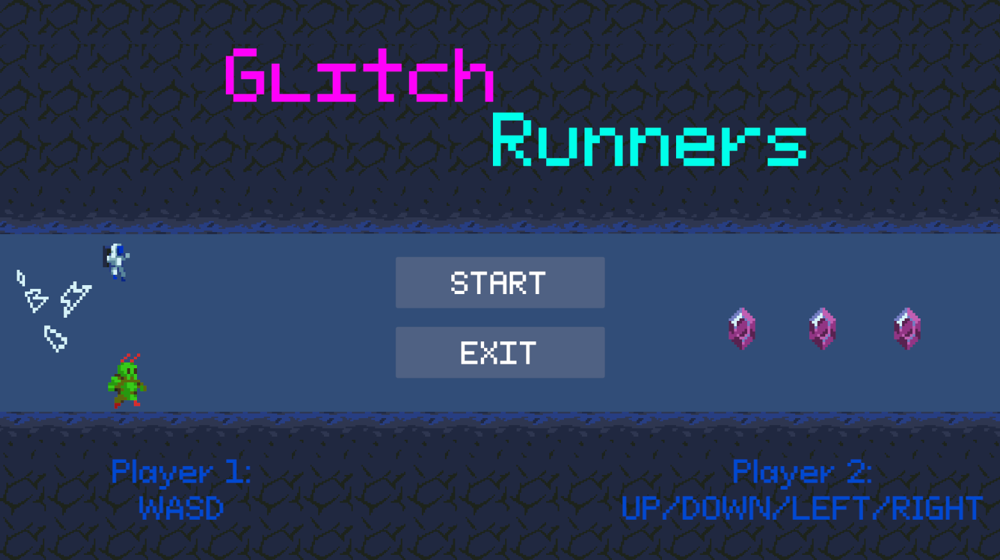

# 🌀 Glitchrunners

**Glitchrunners** is a fast-paced 2-player racing brawler inspired by *SpeedRunners* — made in ~12 hours for a game jam with the theme **“Roll With It”**  
Every match is chaos: random crystals grant power-ups or disasters, forcing you to adapt on the fly.  
Super speed? Slowed down? Stuck in place? You guessed it — *just roll with it.*

---

## Built With **Unity Engine (C#)**

  
---

Game design & Code by **Samuel Wijaya**  
Made for the *“Roll With It”* Game Jam (2025)

---

[Play on itch.io](https://gygabyte.itch.io/glitchrunners)
